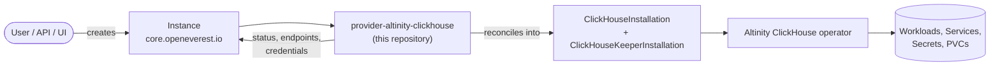

# Altinity ClickHouse Provider

> [!WARNING]
> **Pre-alpha.** OpenEverest v2 and this provider are under active development. CRD schemas,
> chart values and defaults change frequently, including in breaking ways, and there is no
> supported upgrade path between versions yet. Not for production use.

<!-- Remove the pre-alpha banner and the status badge at v2 GA. -->

[](https://github.com/openeverest/openeverest)
[](https://github.com/openeverest/provider-altinity-clickhouse/actions/workflows/ci.yaml)
[](https://pkg.go.dev/github.com/openeverest/provider-altinity-clickhouse)
[](LICENSE)

Run **[ClickHouse](https://clickhouse.com)** on Kubernetes through
[OpenEverest](https://github.com/openeverest/openeverest), backed by the
[Altinity Kubernetes Operator for ClickHouse](https://github.com/Altinity/clickhouse-operator).

## What this is

OpenEverest providers translate a single, technology-agnostic `Instance` custom resource into
the native custom resources of an upstream Kubernetes operator — for databases, but equally
for caches, message queues, object storage, or model-serving runtimes. This repository is the
provider for **ClickHouse**: it owns the technology-specific knowledge — topologies, versions,
parameters — so that users, the API server, and the UI stay technology-agnostic.

> [!IMPORTANT]
> **This provider is not standalone.** It requires an OpenEverest installation (core CRDs and
> controller) in the cluster. Installing this chart on its own does nothing.
> See [Install OpenEverest](https://openeverest.io/documentation/current/quick-install.html).



The provider watches `Instance` resources whose `spec.providerRef.name` is
`provider-altinity-clickhouse`, and reports workload health back onto `Instance.status`. It
never manages pods directly — all lifecycle work is delegated to the operator.

## Compatibility

| provider-altinity-clickhouse | OpenEverest | Altinity ClickHouse operator | Kubernetes |
|---|---|---|---|
| `0.1.0` | `>= 2.0.0` | `0.27.x` | `1.30` – `1.34` |

## Capabilities

| Capability | Status | Notes |
|---|---|---|
| Provisioning | ✅ | |
| Horizontal scaling | ✅ | `spec.components.engine.replicas` (minimum 2 in the `replicated` topology) |
| Vertical scaling (CPU / memory) | ✅ | `spec.components.engine.resources` |
| Version upgrades | ✅ | change `spec.version`; see [Versions](#versions) |
| Custom configuration | ❌ | not yet exposed through the Instance API |
| Monitoring | ❌ | planned |
| TLS | ❌ | not exposed through the Instance API |

Stateful workloads additionally report:

| Capability | Status | Notes |
|---|---|---|
| Persistent storage | ✅ | `spec.components.engine.storage` |
| Storage expansion | ✅ | when the StorageClass allows volume expansion |
| Backups (on demand) | ❌ | planned |
| Backups (scheduled) | ❌ | planned |
| Point-in-time recovery | ❌ | planned |
| Restore | ❌ | planned |

## Installation

The provider chart is published as an OCI artifact:

```bash
helm install provider-altinity-clickhouse \
  oci://ghcr.io/openeverest/charts/provider-altinity-clickhouse \
  --version 0.1.0 \
  --namespace everest-system
```

- The Altinity ClickHouse operator is bundled as a chart dependency and is installed
  automatically. It manages its own CRDs through pre-install/pre-upgrade hooks.

Upgrade and uninstall:

```bash
helm upgrade provider-altinity-clickhouse oci://ghcr.io/openeverest/charts/provider-altinity-clickhouse --version 0.1.0
helm uninstall provider-altinity-clickhouse --namespace everest-system
```

Uninstalling the chart does **not** delete running `Instance` resources or their data.

> [!NOTE]
> **k3d and kind users:** the Altinity operator relies heavily on inotify. The default
> `fs.inotify.max_user_instances=128` causes silent reconciliation failures. Raise it before
> installing:
> ```bash
> echo "fs.inotify.max_user_instances = 8192" | sudo tee /etc/sysctl.d/99-k8s.conf
> sudo sysctl --system
> ```

## Usage

Verify that the provider registered itself:

```bash
kubectl get providers.core.openeverest.io provider-altinity-clickhouse
```

Create an instance:

```yaml
apiVersion: core.openeverest.io/v1alpha1
kind: Instance
metadata:
  name: my-instance
spec:
  providerRef:
    name: provider-altinity-clickhouse
  components:
    engine:
      type: clickhouse
      replicas: 1
      resources:
        requests:
          cpu: 500m
          memory: 2G
      storage:
        size: 10Gi
```

Component names are defined by this provider — see [definition/provider.yaml](definition/provider.yaml).
`spec.version` and `spec.topology` are optional; the provider defaults apply.
More examples live in [examples/](examples/).

Watch it come up and read the connection details:

```bash
kubectl get instance my-instance -w
kubectl get instance my-instance -o jsonpath='{.status.connection}'
```

Credentials are in the secret named by `.status.connection.credentialsSecretRef`.

## Topologies

<!-- BEGIN GENERATED: topologies -->
| Topology | Default | Description |
|---|---|---|
| `standalone` | ✅ | Single ClickHouse node, no coordination dependency |
| `replicated` | | Multi-replica ClickHouse (minimum 2) with an automatically provisioned ClickHouse Keeper quorum |
<!-- END GENERATED: topologies -->

The `replicated` topology provisions a `ClickHouseKeeperInstallation` first and waits for the
quorum to become ready before creating the `ClickHouseInstallation`, so no ZooKeeper is
required. It supports `ReplicatedMergeTree` and the other replicated table engines.

## Versions

<!-- BEGIN GENERATED: versions -->
| Version bundle | Default | clickhouse |
|---|---|---|
| `25.3` | ✅ | `25.3.5` |
| `25.5` | | `25.5.2` |
| `24.8` | | `24.8.14` |
<!-- END GENERATED: versions -->

Source of truth: [definition/versions.yaml](definition/versions.yaml).

## Configuration

- **Chart values:** [charts/provider-altinity-clickhouse/values.yaml](charts/provider-altinity-clickhouse/values.yaml)
- **Instance parameters:** per-component and per-topology `parameters` schemas, defined under
  [definition/](definition/) and published on the `Provider` resource
  (`kubectl get provider provider-altinity-clickhouse -o yaml`). The API server and the UI
  validate user input against these schemas.

This provider currently exposes no technology-specific parameters beyond the shared
component fields (replicas, resources, storage).

## Development

Requires Go (see [go.mod](go.mod)), Docker, Helm, kubectl, and a Kubernetes cluster you can
reach. [dev/README.md](dev/README.md) covers the environment end to end: the recommended
local k3d setup, running against a cluster you already have, and every `dev/.env` setting.

```bash
make dev-up             # local cluster + Tilt dev environment (see dev/README.md)
make generate           # RBAC, provider spec, Helm chart sync
make run                # run the provider locally against the cluster
make test               # unit tests
make test-integration   # chainsaw suites
make dev-down
```

`make help` lists every target. `make verify` fails when generated files are stale — run
`make generate` and commit the result.

The provider contract (`Validate` / `Sync` / `Status` / `Cleanup`), RBAC markers, watches,
and code generation are documented once for all providers in
[PROVIDER_DEVELOPMENT.md](https://github.com/openeverest/provider-sdk/blob/main/PROVIDER_DEVELOPMENT.md).

### Layout

| Path | Purpose |
|---|---|
| `cmd/provider/` | Entry point |
| `internal/provider/` | `ProviderInterface` implementation, RBAC markers |
| `internal/common/` | Component name constants |
| `definition/` | Provider identity, component types, versions, topologies |
| `charts/provider-altinity-clickhouse/` | Helm chart (`generated/` is produced by `make generate`) |
| `config/rbac/role.yaml` | Generated `ClusterRole` — do not edit |
| `examples/` | Example `Instance` resources |
| `dev/` | Tilt dev environment, `.env` configuration, k3d cluster config |
| `hack/` | Helper scripts used by the Makefile |
| `.github/workflows/` | CI: lint, build, unit and integration tests, release |

### Testing

- **Unit tests** — `make test`.
- **Integration tests** — `make test-integration` runs the chainsaw suites.
- **CI** — [.github/workflows/ci.yaml](.github/workflows/ci.yaml) runs lint, build, unit
  tests, generated-file verification, and Helm lint on every pull request.

## Troubleshooting

```bash
kubectl logs -n everest-system deploy/provider-altinity-clickhouse -f
```

| Symptom | Where to look |
|---|---|
| `Instance` stuck in `Creating` | `kubectl describe instance <name>` conditions, then the provider logs |
| No `Provider` resource in the cluster | Is the chart installed? Check the provider deployment logs |
| `Instance` ignored entirely | `spec.providerRef.name` must be `provider-altinity-clickhouse` |
| `ClickHouseInstallation` created but no pods | Inspect its status — the failure is upstream in the operator |
| `replicated` instance never leaves `Creating` | The Keeper quorum has to become ready first; check the `ClickHouseKeeperInstallation` |
| Reconciliation silently stalls on k3d/kind | Raise `fs.inotify.max_user_instances` (see [Installation](#installation)) |

## Contributing

Issues and pull requests are welcome. See
[PROVIDER_DEVELOPMENT.md](https://github.com/openeverest/provider-sdk/blob/main/PROVIDER_DEVELOPMENT.md)
and the [OpenEverest Code of Conduct](https://github.com/openeverest/openeverest/blob/main/CODE_OF_CONDUCT.md).

## Security

Report vulnerabilities per the
[OpenEverest security policy](https://github.com/openeverest/openeverest/blob/main/SECURITY.md).
Please do not open public issues for security reports.

## License

Apache License 2.0 — see [LICENSE](LICENSE) for details.
